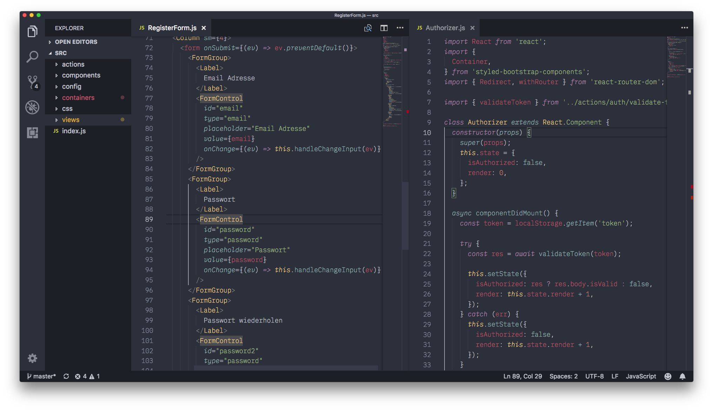
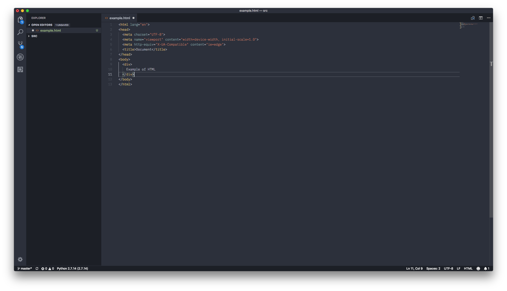
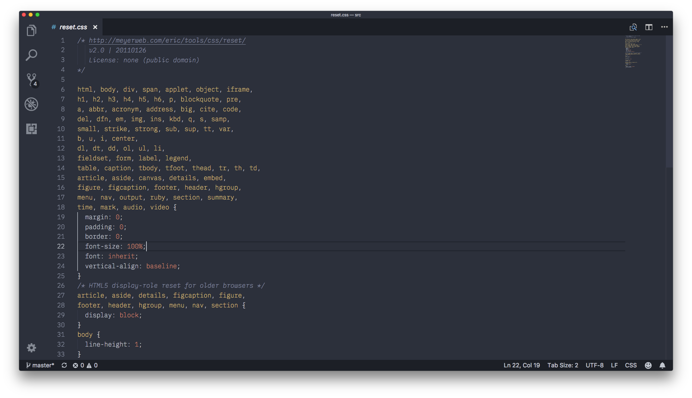
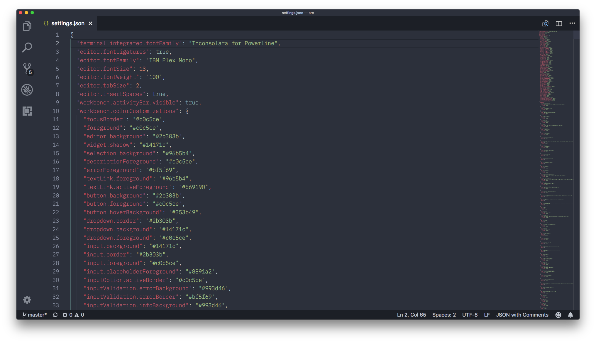
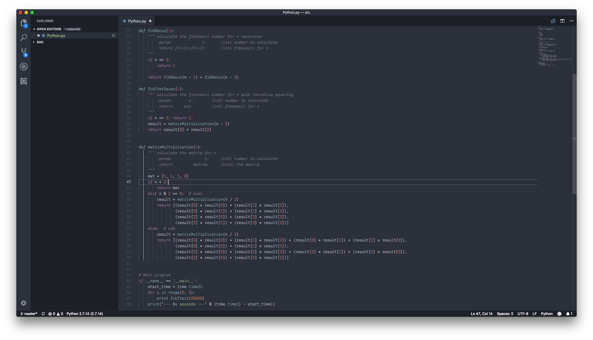
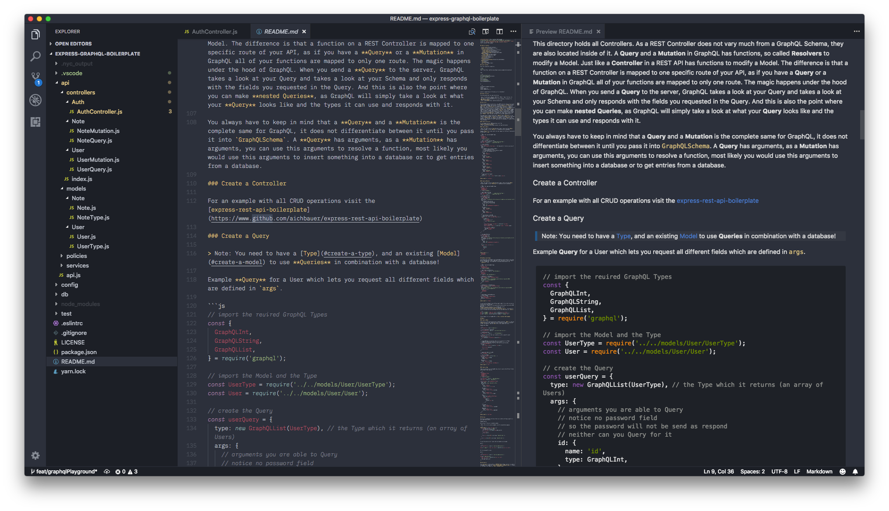

# Space Ocean Kit Refined

This is a refined redesign of the theme [OceanKit](https://marketplace.visualstudio.com/items?itemName=chipcollier.Theme-OceanKit) with a little inspiration from [One Dark Pro](https://marketplace.visualstudio.com/items?itemName=zhuangtongfa.Material-theme).

[GitHub Repository](https://www.github.com/aichbauer/space-ocean-kit-refined)

## Changelog

[CHANGELOG.md](./CHANGELOG.md)

## ScreenShots

To get the best feeling while programming without any distractions it is recommended to use the following additional settings.

```json
{
  "editor.fontFamily": "IBM Plex Mono",
  "editor.fontLigatures": true,
  "editor.fontSize": 13,
  "editor.fontWeight": "100",
  "editor.insertSpaces": true,
  "editor.tabSize": 2,
}
```

[IBM Plex Mono](https://fonts.google.com/specimen/IBM+Plex+Mono) is a free font, which you can get on [Google Fonts](https://fonts.google.com/specimen/IBM+Plex+Mono)

### JS


### JSX (React)



### HTML



### CSS



### JSON



### Python



### Markdown



## Contributing

To keep the developing part as easy as possible, please use the `themes/SpaceOceanKitRefined-dev.json` and copy that into your `settings.json`. When you are finished with your fix or new feature use copy the changes into `themes/SpaceOceanKitRefined-dev.json`.
